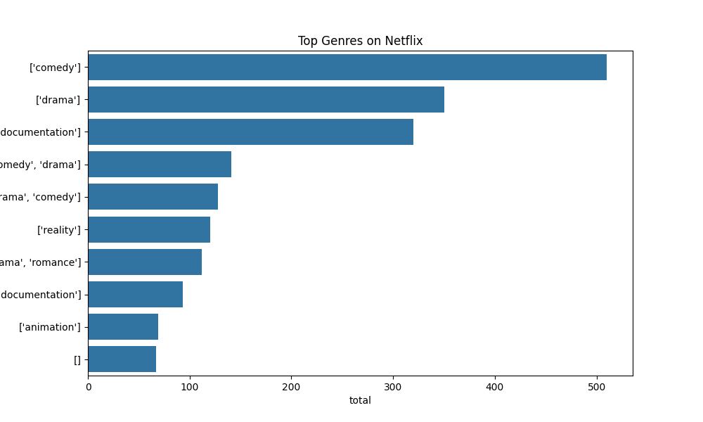
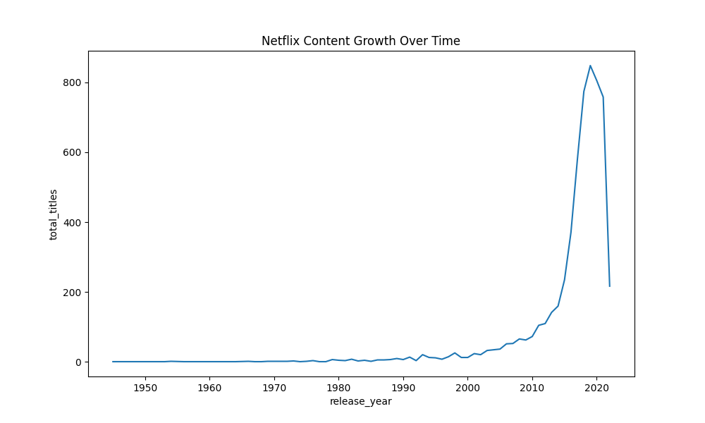
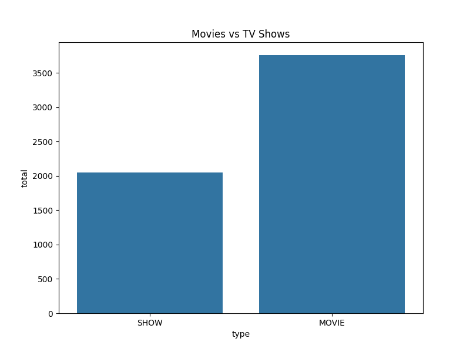
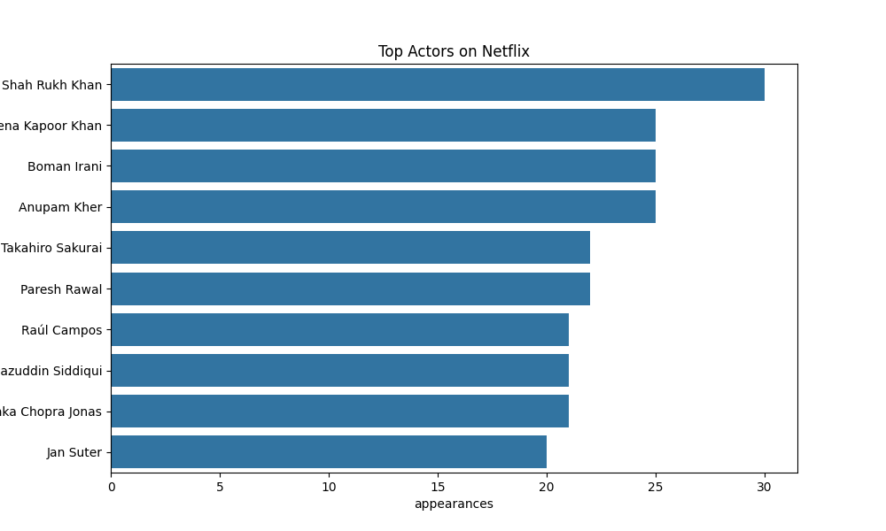
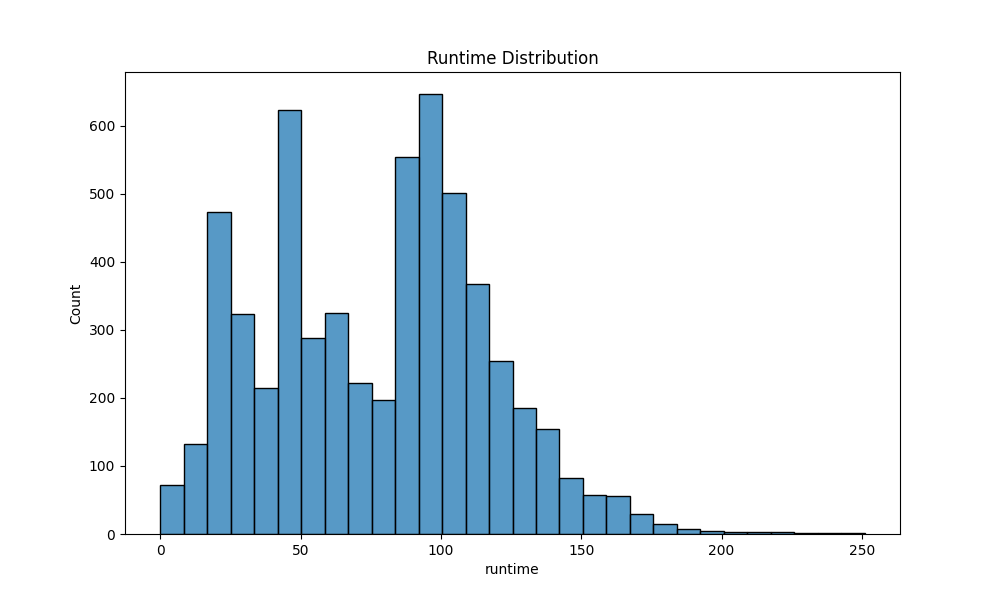

# Netflix Content Intelligence

## Project Overview

This project analyzes Netflix's content catalog to discover patterns in content production, genre distribution, and actor participation.

The analysis combines **SQL, Python, and data visualization** to explore how Netflix content has evolved and what trends exist within the platform’s movies and TV shows.

The project demonstrates a complete **data analytics workflow**, including data cleaning, database integration, SQL analysis, and visualization of insights.

---

## Sample Visualization



---

## Dataset

The dataset contains information about Netflix titles and the actors or crew associated with them.

Two main datasets are used:

**Titles Dataset**
- Contains information about movies and TV shows such as title, type, release year, runtime, and genres.

**Credits Dataset**
- Contains information about actors and other contributors appearing in Netflix titles.

Both datasets were cleaned using Python before being loaded into a PostgreSQL database for analysis.

---

## Technologies Used

The project uses the following technologies:

- Python
- Pandas
- PostgreSQL
- SQLAlchemy
- Matplotlib
- Seaborn
- SQL

These tools were used for data cleaning, database loading, querying, and data visualization.

---

## Project Structure

```
netflix-content-intelligence
│
├── analysis
│   └── insights.md
│
├── data
│   ├── raw_titles.csv
│   ├── raw_credits.csv
│   ├── clean_titles.csv
│   └── clean_credits.csv
│
├── sql
│   └── analysis_queries.sql
│
├── src
│   ├── analysis.py
│   ├── database_loader.py
│   └── visualizations.py
│
├── visuals
│   ├── content_growth.png
│   ├── content_type.png
│   ├── runtime_distribution.png
│   ├── top_actors.png
│   └── top_genres.png
│
└── README.md
```

---

## Data Pipeline

The project follows a structured data analysis pipeline:

```
Raw Data
   ↓
Data Cleaning (Python + Pandas)
   ↓
Cleaned CSV Files
   ↓
Load Data into PostgreSQL
   ↓
SQL Analysis
   ↓
Python Visualizations
   ↓
Insights
```

---

## Key Analysis Questions

This project explores the following analytical questions:

1. How has Netflix content production changed over time?
2. What are the most common genres available on Netflix?
3. What is the distribution between movies and TV shows?
4. Which actors appear most frequently in Netflix titles?
5. What does the runtime distribution of Netflix content look like?

---

## SQL Analysis

SQL queries used for the analysis are stored in:

```
sql/analysis_queries.sql
```

These queries explore content distribution, genre frequency, and actor appearances within the Netflix catalog.

---

## Visualizations

### Content Growth Over Time



This chart shows how the number of Netflix titles has evolved over time.

---

### Movies vs TV Shows Distribution



This visualization compares the number of movies and TV shows available on Netflix.

---

### Most Common Genres


This chart highlights the most frequently occurring genres in the dataset.

---

### Top Actors



This visualization shows which actors appear most frequently across Netflix titles.

---

### Runtime Distribution



This histogram illustrates the distribution of runtimes across Netflix titles.

---

## How to Run the Project

### 1. Install Dependencies

```
pip install pandas matplotlib seaborn sqlalchemy psycopg2-binary
```

### 2. Load the Data into PostgreSQL

Run the database loader script:

```
python src/database_loader.py
```

### 3. Generate the Visualizations

Run the visualization script:

```
python src/visualizations.py
```

The generated charts will appear in the **`visuals/`** folder.

---

## Key Insights

From the analysis of the Netflix dataset, several interesting patterns emerge:

• Netflix content production has increased significantly over the years, showing the platform's rapid expansion.

• Movies make up a larger portion of the catalog compared to TV shows.

• A small number of actors appear frequently across multiple titles, indicating repeated collaborations.

• Certain genres dominate the catalog, suggesting strong audience demand for those categories.

• Most titles fall within a moderate runtime range, with extremely short or long runtimes being less common.

---

## Future Improvements

This project could be extended in several ways:

• Creating an interactive dashboard to explore the data more dynamically.

• Performing deeper analysis of actor collaborations and networks.

• Investigating trends in Netflix content across different release years.

• Expanding the dataset to include additional streaming platforms for comparison.

---

## Author

**Isaak Alemu**

This project was created as part of a **data analytics portfolio** to demonstrate skills in:

- Python
- SQL
- Data processing
- Data visualization
